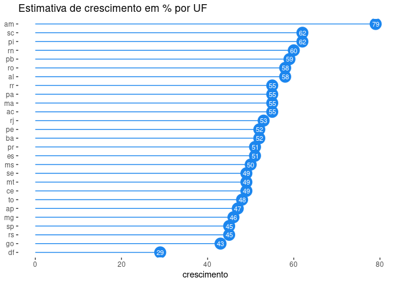

<!-- README.md is generated from README.Rmd. Please edit that file -->

# spatial-credit

<!-- badges: start -->
<!-- badges: end -->

O objetivo desse projeto é permitir uma estimativa do tamanho do mercado
de crédito por município, esse tipo de estudo permite a bancarização do
interior dos municípios do Brasil. Uma vez que decisões de expansão de
Instituições Financeiras são baseadas nesse tipo de informação, como não
há informação, a atratividade desse município que não tem informação é
subestimada. Assim esse modelo pode auxiliar a estimar como seria o
tamanho do mercado do mercado caso a Instituição Financeira abra uma
agência nesse município.

``` r
library(tidyverse)
#> ── Attaching packages ─────────────────────────────────────── tidyverse 1.3.2 ──
#> ✔ ggplot2 3.4.0     ✔ purrr   1.0.1
#> ✔ tibble  3.1.8     ✔ dplyr   1.1.0
#> ✔ tidyr   1.2.1     ✔ stringr 1.5.0
#> ✔ readr   2.1.3     ✔ forcats 0.5.2
#> ── Conflicts ────────────────────────────────────────── tidyverse_conflicts() ──
#> ✖ dplyr::filter() masks stats::filter()
#> ✖ dplyr::lag()    masks stats::lag()
my_df  <-  readRDS(here::here("artifacts","pred_df_complete.RDS"))
my_df_uf <- 
my_df %>% 
  group_by(uf) %>% 
  summarise(
    pred = sum(previsao),
    credito = sum(credito),
    crescimento = round((pred/(pred+credito))*100)) %>% 
  arrange(desc(crescimento))
my_df_uf %>% #slice_max(crescimento, n = 10)
ggplot( 
  aes(x = reorder(uf, crescimento), y = crescimento, label = crescimento)) + 
   geom_point(stat = 'identity', colour = "dodgerblue2", size = 6.5) +  geom_segment(aes(y = 0, 
                   x = uf,
                   yend = crescimento,
                   xend = uf),
               color = "dodgerblue2") +
   geom_text(color = "white", size = 3) +
   labs(title = "Estimativa de crescimento em % por UF") +  
   coord_flip() + theme(
           axis.title.y = element_blank(),
           panel.border = element_blank(),
           panel.background = element_blank()
           )
```

<!-- -->

O modelo prioriza região norte e nordeste do país, estimando a maior
oportunidade em relação ao mercado atual em estados como Amazonas,
Piauí, Rondônia e Paraíba. Enquanto Destrituto Federal, Goiás e São
Paulo são as regiões com menor crescimento proporcional.
